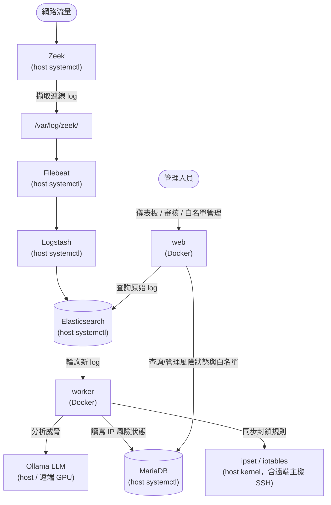
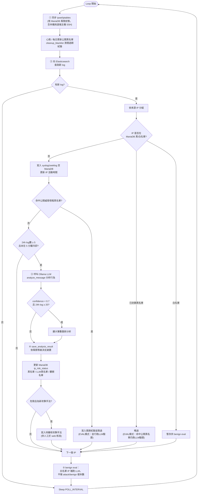

# Security System

以 Zeek 擷取流量、ELK Stack 儲存分析、LLM（Ollama）判斷威脅等級，自動將惡意 IP 同步至 ipset/iptables 黑名單，並提供 PHP Web 儀表板供人工審核。

---

## 系統架構

### 整體流程



### worker 處理流程

worker 是常駐迴圈（每 `POLL_INTERVAL` 秒一輪），每輪依序執行：



> 下一輪迴圈執行步驟 ① 時，會把上一輪寫入 MariaDB 的「黑名單 / LLM黑名單 / 觀察名單」狀態同步到 ipset/iptables，實際完成封鎖或解封。

---

## 服務一覽

| 服務 | 版本 | 運行方式 | 說明 |
|------|------|----------|------|
| Elasticsearch | **8.18.1** | Host systemctl | 儲存所有網路 log |
| Kibana | **8.18.1** | Host systemctl | ELK 視覺化介面 |
| Logstash | **8.18.1** | Host systemctl | Log 解析與轉送 |
| Filebeat | **8.18.1** | Host systemctl | 讀取 Zeek log 並轉送 |
| Zeek | **8.0.3** | Host systemctl | 網路封包擷取 |
| MariaDB | **10.6.x** | Host systemctl | IP 風險狀態資料庫（多產品共用） |
| Ollama | **0.18.0** | Host / 遠端 GPU | LLM 威脅分析（多產品共用） |
| ipset | **7.15** | Host kernel | 黑/白名單 IP 集合 |
| iptables | —— | Host kernel | 流量封鎖規則 |
| nginx | **1.18.0** | Host | 反向代理，將 `/GAIsecurity/` 導向 Web 容器 |
| worker | —— | Docker | Python API：輪詢 ES、呼叫 LLM、同步 ipset |
| web | —— | Docker | PHP 管理儀表板（nginx + php-fpm） |
| vuln-agent | —— | Docker | 主動弱點掃描：nmap + searchsploit + LLM(gemma3:27b) triage；原始碼掃描：gitleaks + semgrep |

> **設計原則**：ELK、MariaDB、Ollama 是跨產品的共用資源，保留在宿主機由 systemctl 管理。  
> Zeek 需直接存取實體網卡（raw socket），不適合容器化。  
> 三個 Docker 容器（web、worker、vuln-agent）只負責應用邏輯。

### vuln-agent：事前弱點掃描（主動防護）

worker 負責「攻擊發生中/後」的流量分析與封鎖，vuln-agent 則補上「攻擊發生前」的一塊：
定期主動掃描自身服務的弱點，在被利用前先行修補。

- 常駐容器，每天 `VULN_SCAN_DAILY_TIME`（預設 `00:00`，依 `TZ=Asia/Taipei`）對 `VULN_SCAN_TARGETS` 自動執行一輪 `nmap -sV -sC --script vuln` + searchsploit 掃描
- 每筆候選弱點交由 LLM（gemma3:27b）判斷是否與偵測到的服務版本相關、給出嚴重程度與修補建議
- 信心不足（confidence < 0.5）時進入 ReAct 自主補充檢測迴圈：LLM 從目前可用的唯讀工具
  （`nmap_script_recheck` / `http_probe` / `searchsploit_search`）中自行決定是否再執行一個工具取得證據，
  最多執行 `VULN_REACT_MAX_ROUNDS`（預設 2）輪後重新判斷；工具清單由程式動態提供，新增工具不需修改提示詞
- 結果寫入 `vuln_findings`，於儀表板「弱點掃描」分頁呈現總覽統計與明細，並可標記 待處理/已確認/誤判/已解決
- 掃描過程即時輸出到容器日誌（每個 port 的候選弱點、LLM 初步判斷、每一輪 ReAct 決策與理由、補充判斷結果），
  可用 `docker compose logs -f vuln-agent` 即時觀察 agent 的判斷過程，不是只回傳最終結果的黑箱

```bash
# 立即手動跑一次（不影響常駐排程）
docker compose run --rm -e VULN_SCAN_RUN_ONCE=true vuln-agent
```

### vuln-agent：原始碼掃描（secrets + SAST）

除了「網路服務版本」層級的已知 CVE，vuln-agent 同時掃描**這台伺服器自己的原始碼**
（`worker`、`web`、`vuln-agent` 三個目錄，唯讀掛載），找出洩漏的機密與程式碼層級的弱點：

- `gitleaks` 掃描原始碼中是否有洩漏的機密（API key、密碼、token 等）
- `semgrep`（規則集 `p/python` + `p/php`）掃描 PHP/Python 的 SAST 問題（如注入、不安全的反序列化等）
- 每筆候選交由 LLM（gemma3:27b）判斷：
  - gitleaks 候選 → 是否為**真實有效**的密鑰，而非範例/測試/預設值（範例值會標記為 `is_relevant=false`、嚴重程度「資訊」）
  - semgrep 候選 → 該規則命中的程式碼在這個專案的上下文中是否真的構成風險
- 信心不足（confidence < 0.5）時進入 ReAct 自主補充檢測迴圈：LLM 可自行呼叫
  `read_file_context`（讀取該行附近程式碼）/ `grep_repo`（在掃描範圍內搜尋固定字串），
  最多執行 `CODE_REACT_MAX_ROUNDS`（預設 2）輪後重新判斷
- **密鑰遮蔽**：gitleaks 找到的密鑰原文絕不進入 LLM prompt 或寫入資料庫，僅保留前後4字元、中間遮蔽（如 `abcd****wxyz`）
- 結果寫入 `code_findings`，於儀表板「原始碼掃描」分頁呈現總覽統計與明細，並可標記 待處理/已確認/誤判/已解決
- 與網路弱點掃描共用同一個常駐排程與 `VULN_SCAN_RUN_ONCE=true` 手動觸發方式

### vuln-agent：掃描報告（彙整摘要 + 風險排序 + 變化趨勢）

每輪排程（網路弱點掃描 + 原始碼掃描）結束後，自動產生一份**合併報告**：

- 彙整目前所有未結案的 `vuln_findings` + `code_findings`，統計嚴重程度分布（高/中/低/資訊）
- 與**上一份報告**比對增量：本次新增幾筆、被標記為「已解決」幾筆
- 依嚴重程度與信心度排序，取前 10 筆列為本次「重點清單」
- 交由 LLM（gemma3:27b）依上述統計與重點清單，產出 2-4 句話的整體風險摘要，
  以及最多 5 筆「優先關注項目」的一句話說明
- 結果寫入 `scan_reports`，於儀表板「掃描報告」分頁呈現摘要、統計卡片、優先關注項目與重點清單

---

## 前置需求

### 宿主機必須先安裝

以下服務需在宿主機安裝並由 systemctl 管理，**容器不包含這些服務**。

#### ELK Stack 8.18.x（三個服務版本需一致）

```bash
# 加入 Elastic 官方 apt repository
wget -qO - https://artifacts.elastic.co/GPG-KEY-elasticsearch | sudo gpg --dearmor -o /usr/share/keyrings/elasticsearch-keyring.gpg
echo "deb [signed-by=/usr/share/keyrings/elasticsearch-keyring.gpg] https://artifacts.elastic.co/packages/8.x/apt stable main" | sudo tee /etc/apt/sources.list.d/elastic-8.x.list
sudo apt-get update

# 安裝
sudo apt-get install -y elasticsearch=8.18.1 kibana=8.18.1 logstash=1:8.18.1-1 filebeat=8.18.1

sudo systemctl enable --now elasticsearch kibana logstash filebeat
```

**重要：ES 需額外開放 Docker bridge 網路存取（見下方設定）**

#### Zeek 8.0.3

```bash
# Ubuntu 22.04
echo 'deb http://download.opensuse.org/repositories/security:/zeek/xUbuntu_22.04/ /' | sudo tee /etc/apt/sources.list.d/zeek.list
curl -fsSL https://download.opensuse.org/repositories/security:/zeek/xUbuntu_22.04/Release.key | sudo gpg --dearmor -o /etc/apt/trusted.gpg.d/zeek.gpg
sudo apt-get update && sudo apt-get install -y zeek=8.0.3-0

sudo systemctl enable --now zeek
```

#### MariaDB 10.6.x

```bash
sudo apt-get install -y mariadb-server
sudo systemctl enable --now mariadb

# 建立 Security System 專用帳號（僅授權 CCT_Security 資料庫）
sudo mariadb -e "CREATE USER IF NOT EXISTS 'Container'@'172.%.%.%' IDENTIFIED BY 'your_password';"
sudo mariadb -e "GRANT ALL PRIVILEGES ON CCT_Security.* TO 'Container'@'172.%.%.%';"
sudo mariadb -e "FLUSH PRIVILEGES;"
```

#### Ollama 0.18.0

```bash
curl -fsSL https://ollama.com/install.sh | sh
# 或指定版本：OLLAMA_VERSION=0.18.0 curl -fsSL https://ollama.com/install.sh | sh
sudo systemctl enable --now ollama

# 拉取所需模型（例：gemma3:12b）
ollama pull gemma3:12b
```

#### ipset / iptables

通常 Ubuntu 已預裝，確認安裝：

```bash
sudo apt-get install -y ipset iptables

# 建立必要的 ipset 集合（首次）
sudo ipset create blacklistv4 hash:net maxelem 1000000
sudo ipset create blackfulllistv4 hash:net maxelem 1000000
sudo ipset create whitelistv4 hash:net maxelem 1000000

# 讓 iptables 套用 ipset 黑名單（首次）
sudo iptables -I INPUT -m set --match-set blackfulllistv4 src -j DROP
sudo iptables -I INPUT -m set --match-set blacklistv4 src -j DROP
sudo iptables -I INPUT -m set --match-set whitelistv4 src -j ACCEPT
```

#### nginx（反向代理）

```bash
sudo apt-get install -y nginx
```

加入 Security System 的 location 區塊至宿主機 nginx 設定（`/etc/nginx/sites-available/default`）：

```nginx
location /GAIsecurity/ {
    proxy_pass         http://127.0.0.1:8082/;
    proxy_set_header   Host              $host;
    proxy_set_header   X-Real-IP         $remote_addr;
    proxy_set_header   X-Forwarded-For   $proxy_add_x_forwarded_for;
    proxy_read_timeout 60s;
}
```

> `8082` 對應 `.env` 中的 `WEB_PORT`，如有衝突請一併修改。

#### Docker & Docker Compose

```bash
# 安裝 Docker Engine
curl -fsSL https://get.docker.com | sh
sudo usermod -aG docker $USER

# Docker Compose v2（通常隨 Docker Engine 一起安裝）
docker compose version
```

---

## Elasticsearch 開放 Docker 容器存取（必要設定）

Web 容器透過 `host.docker.internal`（解析為 `172.17.0.1`）連接宿主機 ES。  
ES 預設只綁定 `127.0.0.1`，需**額外加入** Docker bridge IP，兩個 IP 同時保留：

| 綁定位址 | 用途 |
|----------|------|
| `127.0.0.1` | 宿主機本身（worker、Logstash、Kibana 照常運作） |
| `172.17.0.1` | Docker bridge gateway，讓 web 容器連進來 |

> `172.17.0.1` 是宿主機在 Docker 內部網路（docker0）的 IP，外部網際網路無法存取此位址，**不會暴露 ES 給外人**。

```bash
# 查看目前 network.host 設定（確認是否為 127.0.0.1）
sudo grep -n "network.host" /etc/elasticsearch/elasticsearch.yml

# 若目前是 network.host: 127.0.0.1，執行以下指令（兩個 IP 同時保留，非替換）：
sudo sed -i 's/^network\.host:.*/network.host: ["127.0.0.1", "172.17.0.1"]/' /etc/elasticsearch/elasticsearch.yml

# 若 elasticsearch.yml 中完全沒有 network.host，則在最後追加：
sudo grep -q "^network.host:" /etc/elasticsearch/elasticsearch.yml \
  || echo -e '\nnetwork.host: ["127.0.0.1", "172.17.0.1"]' | sudo tee -a /etc/elasticsearch/elasticsearch.yml

# 確認結果（應看到兩個 IP）
sudo grep "network.host" /etc/elasticsearch/elasticsearch.yml

# 重啟 ES
sudo systemctl restart elasticsearch
sudo systemctl status elasticsearch
```

---

## 快速部屬

```bash
# 1. Clone 專案
git clone <repository-url>
cd Security-System

# 2. 複製設定範本
cp .env.example .env
cp config/security_hosts.json.example config/security_hosts.json

# 3. 填入設定
nano .env
nano config/security_hosts.json

# 4. 建立資料目錄
sudo mkdir -p /var/opt/Security-System/data
sudo chown $USER:$USER /var/opt/Security-System/data

# 5. 建置並啟動容器
docker compose build
docker compose up -d

# 6. 確認狀態
docker compose ps
docker compose logs -f worker
```

---

## .env 設定說明

```bash
# ── Elasticsearch ──────────────────────────────
# 宿主機 ES（host systemctl）
ES_PASS=changeme                              # elastic 帳號密碼
ES_HOST_WORKER=https://localhost:9200         # worker 用（host network mode，直連 localhost）
ES_HOST_WEB=https://host.docker.internal:9200 # web 用（透過 Docker bridge 連宿主機）

# ── MariaDB（宿主機，多產品共用）──────────────
MYSQL_USER=Container      # 專用 DB 帳號（見上方 MariaDB 設定）
MYSQL_PASS=changeme
# MYSQL_DB 固定為 CCT_Security（已寫入 docker-compose.yml）

# ── Ollama LLM ─────────────────────────────────
OLLAMA_URL=http://127.0.0.1:8083/api/generate  # 本機
# OLLAMA_URL=http://192.168.x.x:8083/api/generate  # 遠端 GPU

# ── ipset 集合名稱（通常不需修改）──────────────
IPSET_NAME=blacklistv4
IPSET_FULL_NAME=blackfulllistv4
IPSET_WHITELIST_NAME=whitelistv4

# ── 白名單 IP（不會被封鎖，逗號分隔）────────────
# 必填：自己的 SSH 來源 IP 及主機對外 IP，避免自我封鎖
MANUAL_IPS=140.124.32.16,211.72.136.45

# ── Web 容器對外 Port ───────────────────────────
WEB_PORT=8082  # 視宿主機 port 占用情況調整

# ── 弱點掃描（vuln-agent，逗號分隔IP/hostname）──────────────
VULN_SCAN_TARGETS=127.0.0.1   # 預設只掃描本機
VULN_SCAN_DAILY_TIME=00:00    # 每天自動掃描時間（依 TZ=Asia/Taipei）
VULN_REACT_MAX_ROUNDS=2       # 低信心弱點的 ReAct 自主補充檢測最多輪數

# ── 原始碼掃描（vuln-agent：gitleaks + semgrep）──────────────
CODE_SCAN_ENABLED=true                  # 是否啟用原始碼掃描
CODE_SCAN_PATHS=worker,web,vuln-agent   # 掃描範圍（相對於 repo 根目錄，逗號分隔）
CODE_REACT_MAX_ROUNDS=2                 # 低信心問題的 ReAct 自主補充檢測最多輪數
```

---

## 受控主機設定（security_hosts.json）

`config/security_hosts.json` 定義哪些主機的 ipset 由本系統管理。  
此檔案**不進 git**（含 SSH key 路徑等敏感資訊）。

```json
[
  {
    "name": "local",
    "ip": "127.0.0.1",
    "enabled": true
  },
  {
    "name": "remote-server",
    "ip": "192.168.1.100",
    "port": 22,
    "user": "admin",
    "ssh_key": "/root/.ssh/id_rsa",
    "enabled": false
  }
]
```

> 本機（`127.0.0.1`）worker 直接執行 ipset 指令，不需要 SSH key。  
> 遠端主機需在對方設定 `ipset` 免密碼 sudo 權限（visudo）。  
> **啟動 worker 前務必先設定 `MANUAL_IPS`**，避免封鎖自己的 SSH 來源 IP。

---

## 資料庫 Schema

更新 schema 後重新匯出：

```bash
mysqldump --no-data -u Container -p CCT_Security > config/mysql/init.sql
git add config/mysql/init.sql && git commit -m "update schema"
```

---

## 常用指令

```bash
# 查看容器狀態
docker compose ps

# 即時查看 worker log
docker compose logs -f worker

# 重建並重啟單一容器（程式碼有變更時）
docker compose build web && docker compose up -d web

# 停止所有容器（保留資料）
docker compose down

# 查看 ipset 黑名單數量
sudo ipset list blackfulllistv4 | grep "Number of entries"

# 查看宿主機 ELK 狀態
sudo systemctl status elasticsearch kibana logstash filebeat

# 查看 Zeek 狀態
sudo systemctl status zeek
journalctl -u zeek -f
```

---

## 不進 git 的檔案

| 檔案 | 說明 | 初始來源 |
|------|------|----------|
| `.env` | 密碼與環境設定 | 從 `.env.example` 複製後填入 |
| `config/security_hosts.json` | 受控主機清單（含 SSH key 路徑） | 從 `.example` 複製後填入 |
| `/var/opt/Security-System/data/` | 公開黑名單快取、eval 結果（自動產生） | worker 執行時自動建立 |
